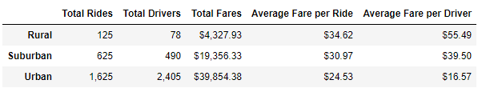
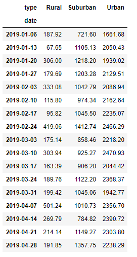

# PyBer Ride-Sharing Analysis

## **Overview of the ride-sharing analysis**: the purpose of this analysis was to summarize of the ride-sharing data by city type in order to create a multi-line graph showing the total weekly fares for each city type. 

### To that end, we were first asked to merge two sets of data, one being the list of rides by city, date and fare amount, and the second one being the list of cities, city types and driver count. Once those 2 CSV files were merged, we were able to summarize our data.

## **Analysis results**:

1. The first part of the analysis was focused on summarizing all data by city type. Using the groupby(), count() and sum() functions, we developed the below dataframe:

### Only 5% of the total rides took place in Rural cities, but the average fare per ride in Rural cities was $34.62, or 41% higher than in Urban cities, and the average fare per driver in Rural cities was $55.49, or 235% higher than in Urban cities.
### 63% of the total fare revenues came from Urban cities for a total of $39,854, with a total of 1,625 rides. However, 81% of the total drivers were located in Urban cities, which drove down the average fare per driver to $16.57. 
### With a total of 625 rides and 490 drivers in Suburban cities, the average fare per ride was $30.90, and the average fare per driver was $39.50 (2.4 time higher than in Urban cities). 

2. The second part of the analysis was focused on summarizing the data by date, and specifically by week, for the period of January 1, 2019 through April 29, 2019. Using the pivot() and resample() functions, we were able to create a multiple-line graph that showed the total fares for each week by city type.

## **Analysis summary**:

Each of the city type lines are moving pretty consistently accross each week between January and April 2019. That means that historically, rides are fairly consistent in total fares between city types.
Based on our analysis, below are some recommendations for our CEO:
1. Increase the number of drivers in Rural cities (especially around April 1), since the average fare per driver and average fare per ride in much higher there than in Urban and Suburban cities
2. Reduce the number of drivers in Urban cities, since the majority of the fare revenues come from Urban cities yet the average fare per driver is only $16.57.
3. Move some of the Urban drivers to Suburban areas, since there were only 490 drivers there, but the average fare per driver was $39.50.

